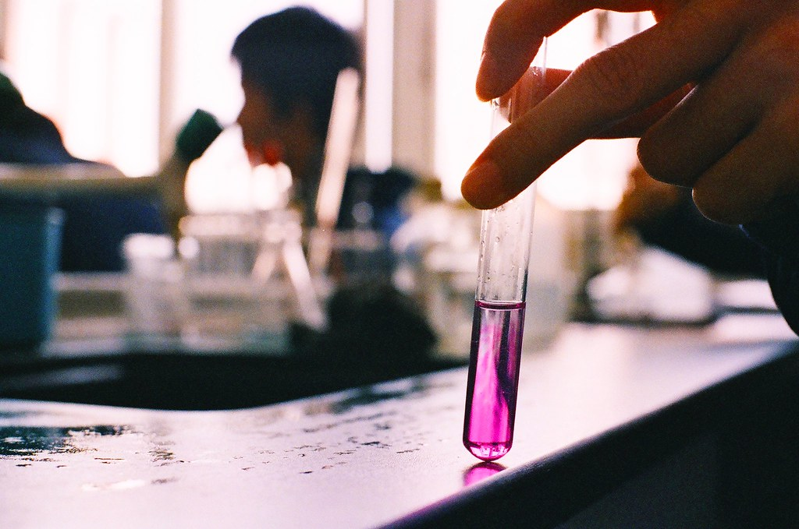

```{r setup, include=FALSE}
knitr::opts_chunk$set(echo = TRUE)
library(shiny)
library(ggplot2)
library(xtable)
library(DT)
library(viridis)
library(RColorBrewer)
library(knitr)
library(png)
library(cowplot)
library(plotly)
library(viridis)
library(autoimage)
library(shinyWidgets)
library(plyr)
library(dplyr)
library(data.table)
library(countrycode)
library(igraph)
library(visNetwork)
library(fst)


source_rmd <- function(rmd_file){
  knitr::knit(rmd_file, output = tempfile())
}

```

```{r context="data", echo=FALSE}
# Load data on patent counts / prepared in section_II/prep_report.R
## Use now fst speed gain for loading data: fst 70 ms readRDS 110 ms
numpat_data <- read.fst("numpat_data.fst")

# Load data on labor productivity / prepared in section_II/prep_report.R
labprod <- read.fst("labprod.fst")

# Load data on employment / prepared in section_II/prep_report.R
ilo <- read.fst("ilo.fst")

# Load GVA data 
gva <- read.fst("gva_data_ch.fst")

# Load data on exports / prepared in section_II/prep_report.R
volumes <- read.fst("trad_data.fst")
map_world <- read.fst("map_data.fst")

# Load citation-flow data  / prepared in section_II/prep_report.R
citflow_ctry_back <- read.fst("citflow_ctry_back.fst")
citflow_ctry_forw <- read.fst("citflow_ctry_forw.fst")
```	

<!-- <head> -->
<!-- <!-- Global site tag (gtag.js) - Google Analytics --> -->
<!-- <script async src="https://www.googletagmanager.com/gtag/js?id=UA-71167447-1"></script> -->
<!-- <script> -->
<!--   window.dataLayer = window.dataLayer || []; -->
<!--   function gtag(){dataLayer.push(arguments);} -->
<!--   gtag('js', new Date()); -->
<!--   gtag('config', 'UA-71167447-1'); -->
<!-- </script> -->
<!-- </head> -->


<br>


<br>

<!-- <a href="http://cieb.unibas.ch/" target = "_blank">{ width=30% }</a> -->

<br>

## **The pharmaceutical industry: a driver of innovation and growth in Switzerland **
*October 2020* by <a href="https://wwz.unibas.ch/de/personen/dragan-filimonovic/" target = "_blank">Dragan Filimonovic</a>, <a href="https://wwz.unibas.ch/de/personen/matthias-niggli/" target = "_blank">Matthias Niggli</a> and <a href="https://wwz.unibas.ch/de/personen/christian-rutzer/" target = "_blank">Christian Rutzer</a>

<br>

{width=100%}

Picture: <a href="https://search.creativecommons.org/photos/09d2bb2d-245b-4435-91cc-ea5e33b89840" target = "_blank">Beryl_snw | Flickr</a>


<br>


<div class=bloc_div>
<blockquote>***“The pharmaceutical industry is a major contributor to quality of life and prosperity
in Switzerland. At the same time, Switzerland traditionally provides an attractive
operating environment for innovative pharmaceutical companies. However, it is
increasingly losing ground in terms of competiveness to other countries.”
<a href = https://www.interpharma.ch/wp-content/uploads/2020/05/low_interpharma_broschure_A4_rz_en_DS_compressed.pdf target = “_blank”>(Interpharma, p.7)</a>
***</blockquote>
</div>

<br>

The Swiss pharmaceutical sector has a major impact on Switzerland’s economy and the well-being of its citizens in general. It is a true example of a world-class innovation hub and is one of the industry’s global leaders when it comes to R&D activities. Nonetheless, one of the concerns, often pointed out in public, is whether the pharmaceutical industry in Switzerland will be able to overcome the rising challenges of a vibrant environment in which it operates and will it be able to retain its top position in the future. In this report, we revisit how it has evolved and discuss its current importance for the whole economy, laying grounds for our upcoming set of analyses on how to strengthen innovation capacities of Swiss pharmaceutical firms in the future.

## **Economic impact of the Swiss pharmaceutcial industry**

<br>
<div class="box_div">	

<details>
  <summary style="font-size:11pt">*Click here for details about the data we used for this analysis*</summary>

* **Figure 1: Steady increase of pharmaceutical job**: Data are taken from <a href = https://ilostat.ilo.org/data/ target = “_blank”>ILOSTAT</a> database. Employment data comes from the local labor force surveys which cover only the resident population. This means that the employment figures do not cover cross-border commuters. In addition, given that an employed person may hold several jobs the employment refers to his or her primary job only. Finally, this data covers all persons of working age who, during a specified brief period, were either in paid employment or self-employed.

* **Figure 2 Pharma's growing importance for the Swiss economy**: Data on gross value added are from the <a href = https://www.bfs.admin.ch/bfs/en/home/statistics/catalogues-databases/tables.assetdetail.14347536.html target = “_blank”>FSO</a> - Industries production account database.

* **Figure 3 Open and highly productive**: Data on gross value added are similar than for the previous figure. In addition, we used labor force survey data on the number of employees from <a href = https://ilostat.ilo.org/data/ target = “_blank”>ILOSTAT</a> database; firms survey data on the number of jobs from <a href = https://www.pxweb.bfs.admin.ch/pxweb/en/px-x-0602000000_101/px-x-0602000000_101/px-x-0602000000_101.px target = “_blank”>FSO</a>; and data on cross-border workers from <a href = https://www.pxweb.bfs.admin.ch/pxweb/de/px-x-0302010000_106/px-x-0302010000_106/px-x-0302010000_106.px target = “_blank”>FSO</a> database.
The FSO defines a job as follows: "The term “jobs” refers to all positions of employment that are filled. While largely covering the same concept, "jobs" and "employed persons" do not always coincide, given that an employed person may hold several jobs. In such cases, the employed person holds one primary job and one or more secondary jobs" (<a href = https://www.media-stat.admin.ch/web/apps/glossary/index.php?n=glo-165-en target = “_blank”>FSO</a>). In addition, ILO data on employment covers only the residents given that it is collected via local labor force surveys. We utilize this differences to create three different labor productivity indicators, primarily by assuming that ILO employment data represents a good approximation for jobs held by Swiss residents.

* **Figure 4: Exporting to every corner in the world**: Data on exported goods are taken from the 
<a href = https://stats.oecd.org/Index.aspx?DataSetCode=STANI4_2020 target = “_blank”>OECD</a>. Exports are measured using freight on board valuation methodology and are adjusted for re-export values (whenever possible). Values in million USD show the Swiss pharmaceutical exports in current US dollars to a given partner country. The indicator % of total Swiss exports to the destination represents the share of Swiss pharmaceutical exports in total Swiss exports to a given partner country and % of total Swiss pharma exports represents the share of Swiss pharmaceutical exports to each partner country in total Swiss pharmaceutical exports.

</details>
</div>

<br>

Today, the pharmaceutical industry directly employs around 33’000 individuals with permanent residency in Switzerland. Furthermore, around 7 thousand cross-border commuters work in the Swiss pharma sector. The interactive graph below illustrates absolute and relative employment figures in the pharmaceutical industry across different countries. Although the absolute numbers may seem to be low, the share of employees in the Swiss pharmaceutical sector in total number of employed individuals is two times larger compared to those of the USA, Germany, France or Italy. Interestingly, the share of employment in the pharmaceutical industry in Switzerland is similar to Belgium, but the Swiss workers are creating a much higher economic impact than their Belgium colleagues suggesting extraordinary high productivity levels.

<br>
<hr class="hr_red">
##### **Steady increase of pharmaceutical job**
```{r, echo = F, child = file.path(knitr::opts_knit$get("output.dir"), "emp_output.Rmd")}
```
<span style="font-size:0.8em">*Source: Authors' own estimations based on data from the <a href = https://ilostat.ilo.org/data/ target = “_blank”>ILOSTAT</a>*</span>

<br>

Even with such a "low" number of employed persons, the pharmaceutical industry in Switzerland is generating an immense added value for the Swiss economy. This implies a very high level of labor productivity relative to other manufacturing industries (even taking into account the large number of cross-border commuters employed in the sector). Hence, in recent years, the pharmaceutical industry has contributed substantially to the Swiss welfare, accounting for more than 5% of the total gross value added in the economy (see <a href = https://www.bfs.admin.ch/bfs/en/home/statistics/catalogues-databases/tables.assetdetail.14347536.html target = “_blank”>Federal Statistical Office of Switzerland, FSO</a>). However, the true rise of the Swiss pharmaceutical industry has only begun after the year 2000, when it overpassed the two other big Swiss industries – manufacture of computer, electronic and optical products, which also includes the world-famous Swiss watches; and manufacture of machinery and equipment.

<br>

<hr class="hr_red">
##### **Pharma's growing importance for the Swiss economy**
```{r, echo = F, child = file.path(knitr::opts_knit$get("output.dir"), "gva_output.Rmd")}
```
<span style="font-size:0.8em">*Source: Authors’ own calculations based on data from the <a href = https://www.bfs.admin.ch/bfs/en/home/statistics/catalogues-databases/tables.assetdetail.14347536.html target = “_blank”>FSO</a>*</span>

<br>

The fact that less than 1% of the labor force generates more than 5% of value added is remarkable and deserves more attention. Obviously, the following question arises: How dependent is the Swiss pharmaceutical sector’s high productivity on foreign workers, especially on cross-border commuters? In order to illustrate this, we present three productivity estimates that use different definitions of the number of employees: (a) workers with residence in Switzerland, (b) total number of jobs and (c) workers with residence in Switzerland + cross-border commuters. We define the labor productivity for each sector as the gross value added (GVA) in CHF per worker.

The labor productivity in the pharmaceutical sector varies heavily depending on the used definition of workers. Taking into account the cross-border commuters, the productivity estimates drop by roughly 30% and when considering the total number of jobs, it drops by nearly 40% compared to calculations that use the Swiss residents only. This highlights the fact that the Swiss pharmaceuticals' performance is substantially dependent on the foreign labor force. This result also coincides with another analysis within the Innoscape Project on the importance of cross-border commuters for inventions 'Made in Switzerland' (cite Matthias output). However, regardless of the indicator used, the labor productivity of the pharmaceutical industry is by far the highest among Swiss manufacturing sectors. 

<br>
<hr class="hr_red">
##### **Open and highly productive**
```{r, echo = F, child = file.path(knitr::opts_knit$get("output.dir"), "labprod_output.Rmd")}
```
<span style="font-size:0.8em">*Source: Authors' own estimations based on data from the <a href = https://ilostat.ilo.org/data/ target = “_blank”>ILOSTAT</a> and the <a href = https://www.pxweb.bfs.admin.ch/pxweb/de target = “_blank”>FSO</a>*</span>

<br>

## **The market for pharmaceuticals is global** 

<br>

Access to skilled labor from abroad is important but free international trade may be even more significant for the growth of the Swiss pharmaceutical industry. The market for pharmaceutical products is global and the home-market is limited in its size, thus the Swiss pharmaceutical firms are required to nurture their export activities. Although Swiss pharma export figures are rising steadily in the last 30 years, there are some potential caveats concerning these export trends. For example, back in 1990, pharmaceutical products comprised less than 10% of the total Swiss exports to most destinations. Yet, in 2019 the share of pharma exports made up almost 30 % of the total exported goods in most of destination countries, making the overall Swiss export performance increasingly dependable on a single sector. Furthermore, the geographical dispersion of export destinations is also changing. In 1990 around 8 % of total Swiss pharma exports went to the USA, while in 2019 this share was roughly 26%. On the one hand, a larger export orientation towards the USA (and Germany) could produce certain concentration risks. But on the other, it may reveal important geographical innovation patterns and collaborations in facilitating new approaches in future research. In other words, the flow of pharmaceutical products may trail the flow of knowledge (more on this topic in our report on inventors’ nationalities - coming out soon).

<br>

<hr class="hr_red">
##### **Exporting to every corner in the world**
```{r, echo = F, child = file.path(knitr::opts_knit$get("output.dir"), "export_output.Rmd")}
```
<span style="font-size:0.8em">*Source: Authors' own estimations based on data from the <a href = https://stats.oecd.org/Index.aspx?DataSetCode=STANI4_2020 target = “_blank”>OECD</a>*</span>

<br>

## **Swiss Pharma: A world class innovator** 

"The core task of research-based pharmaceutical companies is to combat disease by developing innovative medicinal products and to make these medicines available to patients as quickly as possible" <a href = https://www.interpharma.ch/wp-content/uploads/2020/05/low_interpharma_broschure_A4_rz_en_DS_compressed.pdf target = “_blank”>(Interpharma, p.9)</a>. Hence, innovation is key in the pharmaceutical sector and, protecting intellectual property is an important aspect of the Swiss pharmaceutical industry's R&D activity. According to Severin Schwan (CEO, Roche) without patents there would be no innovation in the pharmaceutical sector (Interview in <a href =  https://www.adlittle.com/sites/default/files/prism/Interview_with_Severin_Schwan.pdf target = “_blank”>Prism, 2013</a>). In the scientific literature, patents are often used as a proxy for innovation and as a metric for deriving knowledge flows (see the scientific collaboration network of the pharmaceutical industry below). Even though being an imperfect measure, they still represent a standardized measure in evaluating knowledge diffusions and innovation effectiveness (for a recent literature survey, please see: <a href = https://onlinelibrary.wiley.com/doi/full/10.1111/obes.12365 target = “_blank”>Arvanitis, Seliger and Wörter, 2020</a>).

The Swiss pharmaceutical sector is often denoted as “one of the most important centers of pharmaceutical research world-wide, with a reputation that reaches far beyond Europe” (<a href = https://www.interpharma.ch/wp-content/uploads/2020/05/low_interpharma_broschure_A4_rz_en_DS_compressed.pdf target = “_blank”>Interpharma, p.7</a>). However, the number of published patents in the pharmaceutical sector in Switzerland is slowly losing its pace after 2008, a trend also visible in many other countries. In addition, during the same period the share of pharma patents in total patent applications is also declining, from 17% in 2007 to 7% in 2015, which indicates that, relative to other industries, the Swiss pharmaceutical sector lost some of its importance for the overall domestic innovation activity. Note, however, that these figures represent patent counts, which are quantitative measures of innovation. In turn, these measures can’t say much about the quality and importance of new inventions in different sectors. Nonetheless its relative decline, the pharmaceutical sector still remains highly ranked when it comes to the innovation intensity in total patent applications. Switzerland has also a very high revealed comparative advantage in creating pharma patents (among top 10 countries world-wide), meaning that it possesses a particular strength in pharmaceutical innovations compared to the rest of the world. Interestingly, Spain is positioning itself as the world-leader according to the RCA index. Spanish patenting intensity was more resilient to the 2008 crisis than the Swiss, implying that in the future we may expect the rise of pharmaceutical industries in other countries, even among those considered as untraditional pharma hubs. This could make the overall competition in the world healthcare market even harsher.

<br>

<hr class="hr_red">
##### **Patent Counts: The Output of Pharmaceutical R&D**

<div class="box_div">	
<details>
  <summary style="font-size:11pt">*Click here for details about patent counts*</summary>
  
Patent data for US patents are taken from <a href = https://www.patentsview.org/download/ target = “_blank”>patentsview.org</a> (considers data till August 27, 2020) and for EPO patents from the  <a href = http://www.oecd.org/sti/inno/intellectual-property-statistics-and-analysis.htm target = “_blank”>OECD intellectual property (IP) statistics and analysis database</a> (considers data till January, 2020). Absolute values are pharmaceutical patent (application and approval) counts for each country, where the inventor’s residence determines the patent’s geographical affiliation, with one exception, for Switzerland, we correct for patent applications of cross-border commuters, as they contribute significantly to patent developments of Swiss firms. For details see (link to Output of Matthias). Moreover, as stated there in the box “Searching for cross-border commuting inventors in Switzerland”, in order “to assign patents to a year, we use the so-called priority year. The priority year indicates the year a patent was first filed at a patent office anywhere in the world. This date comes closest to the real time of the invention. Therefore, it is often used when analyzing innovation activities by means of patent statistics (for more information, see e.g. OECD, 2008). However, since it takes time between the filing and publishing of a patent, the priority date trails behind the publication date of patents. Thus, in order to present a comprehensive picture of inventor activity, we limit ourselves to showing only patents up to the priority year 2015”, Furthermore, our patent counts only include the so-called triadic patents – those which are registered by all three major patent offices (European Patent Office, Japan Patent Office and the US Patent and Trademark Office), protecting the same invention. By taking such patents into account, home advantage and influence of geographical locations are significantly reduced. However, note that our patent counts may differ, in absolute values, from the <a href = https://stats.oecd.org/Index.aspx?DataSetCode=PATS_IPC# target = “_blank”> OECD </a> database triadic patent counts database because the OECD data is based on patent families while our includes all distinct patents (ie, number of all non-equivalent patents) belonging to a triadic patent family. In case of inventors coming from different countries, the geographical division is assigned and then summed as shares. For example, if one inventor comes from the USA and the other from Japan, the same patent will be assigned as 0.5 to the USA and 0.5 to Japan (for more information on how to determine the origins of patents see GRENZGÄNGER-OUTPUT). The indicator "% in Total patents" represents the share of pharmaceutical patents in total patent applications across each country, "RCA" in Pharma patents represents the so-called "revealed comparative advantage" in patenting pharmaceutical products. It is the share of pharmaceutical patents in total country’s patents divided by the share of total world pharmaceutical patents in total world patents. It thus represents a measure of international innovativeness of an industry relative to the entire economy of a country.

</details>
</div>

## {.tabset}

### Continents

```{r, echo = F, child = file.path(knitr::opts_knit$get("output.dir"), "conti_func.RMD")}
```

### Countries

```{r, echo = F, child  = file.path(knitr::opts_knit$get("output.dir"), "ctry_func.Rmd")}
```

### Regions

```{r, echo = F, child  = file.path(knitr::opts_knit$get("output.dir"),'regio_func.Rmd')}
```

## {.unlisted .unnumbered}


<br>

America (predominantly North America) is still the world leading continent when it comes to the number of filed patent applications in the pharmaceutical sector. In addition, Asia surpassed Europe in 2014 and took its long held place as the second most important pharma patenting hub, slowly approaching the America’s numbers. Looking at the relative indicators, however, another pharma rising star continent appears on the horizon – Australia and Oceania, which has an extremely large share of pharma patents in its total patents, indicating a high degree of specialization in the pharmaceutical research that started in the late 90s. It is a continent with the highest and steadily increasing RCA index, which points out that the Australia’s time as a pharma innovation power is most probably yet to come, and in the near future. Melbourne is Australia’s main life-sciences research hub and primarily responsible for a robust growth of its pharmaceutical and other related industries. Australia is continuously ranked among the top five countries world-wide in biotechnology innovations whose success stems from its “…educated population, strong academic institutions, favorable regulatory and R&D environment, and a supportive government” <a href = https://static.scientificamerican.com/wv/assets/2016_SciAmWorldView.pdf target = “_blank”>(Scientific American Worldview 2016, p.18)</a>.

The North-West Switzerland ranks very high among the world most important pharma innovation regions. Being the home to Swiss (and World’s) pharmaceutical giants - Novartis and Roche, it is a place to be if you are interested in health-care innovations. Among the 76 most important regions for the pharmaceutical research world-wide, the North-West Switzerland takes the 16th place (according to the patent rankings in 2000), leaving numerous US, Japanese, German and other regions behind. Couple of other regions in Europe, however, are ahead in terms of absolute numbers of patent applications, but taking into account relative terms and, thus, differences in size across the regions, the North-West Switzerland ranks number one in Europe as shown by our RCA-index.    

If the pharmaceutical industry in Switzerland wants to maintain and improve its current high levels of innovation, international connectivity and access to global knowledge might be crucial. These aspects are what we examine next. We derive technological (or inter-sectoral) connectivity of Swiss pharmaceutical innovations from patent citations. Below we present the so-called backward and forward citations of the Swiss pharmaceutical patents across different technologies and geographical areas (see methodological explanations below for more details). These citations show what technological fields are important for developing new patents in the Swiss pharmaceutical sector and, vice versa, what technologies benefit from using the Swiss pharmaceuticals’ patents for developing their own inventions.

<br>

## **Knowledge Flows: Disentangling pharmaceutical patent citation networks**
<br>

In the early 90s, new Swiss pharma patent applications drew knowledge from a very limited number of fields outside pharmaceuticals (medical technology (6%), measurement (3%), machinery (3%), organic chemistry (2%) and computer technology (1%)) and in a very limited scope. Swiss innovations in the pharmaceutical industry were predominantly pharma-centric, where 84% of all cited patents were classified as pharmaceutical technology. Hence, at the time, innovations in the Swiss pharmaceutical sector were not much dependent on the knowledge exchange with other scientific fields. However, since the late 1990s the sectoral citation network of Swiss pharma patents started its evolution in terms of both the extensive (number of different fields) and intensive margin (share of citations per field), reaching its peak in 2013, where only 43% of new pharma patents used the knowledge created by the pharmaceutical technology. The citation network shifted strongly towards biotechnology depicting the ongoing fast-paced changes in the industry, fundamentally impacting its R&D activities.  The knowledge inflow trends in the Swiss pharmaceutical innovations are comparable to those observed in the USA. However, the use of biotechnology applications (the most important knowledge source for pharmaceuticals today) was pronounced somewhat earlier in the US pharma patents than in other countries. This may have given the US firms a competitive edge over other regions, cementing their position as the world’s leading pharma innovation cluster of today.

The knowledge outflows (forward citations) of pharmaceutical innovations closely resemble the structure and trends observed in its knowledge inflows (backward citations). Hence, the scientific output of pharmaceuticals and other related fields such as (among others) biotechnology, organic, medical or food chemistry are highly complementary. For instance, this means that a strong pharmaceutical industry in a given region probably cannot exists without highly developed research centers in biotechnology and chemistry close by (like in the Region of Basel) and that the increase in the pharmaceutical sector’s innovation capacities may have a substantial multiplicative spillover effect on other industries. Through the entire period from 1990 to 2015, roughly 50% of Swiss pharma patents are cited from “outside”, i.e. by the new patent applications from technological fields other than pharmaceuticals. Nonetheless, if the recent knowledge flow geography is observed, it is noticed that over 60 % of both knowledge inflows and outflows regarding the Swiss pharmaceutical patents are linked to the USA, confirming the strong cooperation between the US and Swiss pharmaceutical companies also visible in the trade data.         
<br>

<hr class="hr_red">
##### **Citations**
<div class="box_div">	
<details>
  <summary style="font-size:11pt">*Click here for details about patent citations*</summary>
  
See previous box for information on patent data. In addition, backward citations are the number of patents that have been cited by patents of the Swiss pharmaceutical industry in a given year. All shown values are relative to the total backward citations of the Swiss pharmaceutical industry in a given year. We show only those technologies that have a share of at least 0.01 in a given year. We group them across technological fields and continents, where the cited patent’s technological field number determines its technological affiliation. Forward citations are the number of citations made to patents of the Swiss pharmaceutical industry. We again show shares and group them across technological fields and continents, where the citing patent's field number determines its technological affiliation. For both plots, the citations of group "all" cover foreign and domestic patents of all technology fields.
</details>
</div>
<br>

```{r, echo = F, child = file.path(knitr::opts_knit$get("output.dir"), "citnetwork_output.Rmd")}
```

## **Main take-aways**

<br>

* Employment shares of the domestic labor force in the Swiss pharma sector is two times larger than in the USA, Germany, France or Italy

* Less than 1% of the labor force generates more than 5% of Swiss GDP

* Taking into account the cross-border commuters the productivity estimates drop by 30%

* In 2019, 30 % of the Swiss exports are pharmaceutical products and 26% of the total Swiss pharma exports goes to the USA

* Innovation activities in the Swiss pharmaceutical sector are still world class, but some new innovation hubs are strongly emerging

* Roughly 50% of new Swiss pharma patents use knowledge from other fields


<br>

**Interested in more details** about the role of cross-border commuters for Swiss (pharma) innovations? Then check out (cite Matthias output).

<br>

**Want to learn more** about the quallity of future innovation activities in the Swiss pharmaceutical industry? Have a look at (cite Christian output).

<br>
<br>

<span style="font-size:0.8em">*This report was written using <a href = https://rmarkdown.rstudio.com/ target = “_blank”>R Markdown</a> and <a href = https://shiny.rstudio.com/ target = “_blank”>R shiny</a>. For the creation of the patent data set, we used <a href = http://scicore.unibas.ch/ target = “_blank”> sciCORE </a> scientific computing center at the University of Basel. Data and code to reproduce the figures presented in this article are available on <a href= "https://github.com/cieb-unibas/innoscape-part-II-descriptive-analysis/tree/master/report" target="_blank">GitHub</a>.*</span>

<br>

**Share this article**
```{r, echo = F}
actionButton("twitter_share",
                   label = "",
                   icon = icon("twitter"),
                   onclick = sprintf("window.open('%s')", "https://twitter.com/intent/tweet?d&url=https://https://cieb.shinyapps.io/innoscape_pharma/"))
actionButton("twitter_share",
                   label = "",
                   icon = icon("linkedin"),
                   onclick = sprintf("window.open('%s')", "https://www.linkedin.com/sharing/share-offsite/?url=https://https://cieb.shinyapps.io/innoscape_pharma/"))
actionButton("xing_share",
                   label = "",
                   icon = icon("xing"),
                   onclick = sprintf("window.open('%s')", "https://www.xing.com/app/user?op=share;url=https://https://cieb.shinyapps.io/innoscape_pharma/"))
actionButton("facebook_share",
                   label = "",
                   icon = icon("facebook"),
                   onclick = sprintf("window.open('%s')", "https://www.facebook.com/sharer/sharer.php?u=https%3A%2F%2Fcieb.shinyapps.io%2Finnoscape_pharma%2F&amp;src=sdkpreparse"))
```

<br>
<br>
<br>
